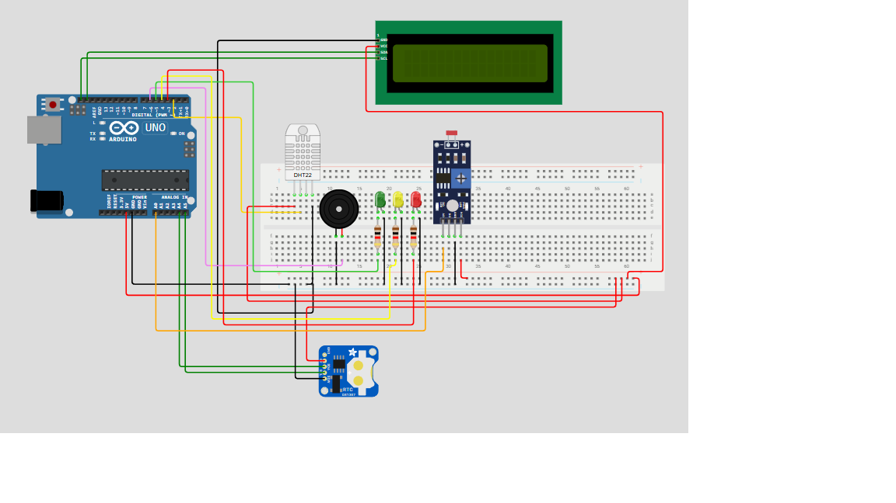

# Data Logger CHRONO



[Manual](docs/manual.pdf)

[Video]()

## Commands

```
@set, s
	[dt, d] <ISO-Formatted Date>
	[radj, ra, a] <min> <max>
	[ldr, l] <min> <max>
	[hum, h] <min> <max>
	[temp, t] <min> <max> <{c}, f, k>
	[zone, z] <hour>:<minute>
	[unit, u] <c, f, k>

@read, r
	{sensors}
	rawldr
	
@wipe, w
	log
	absolutelyeverything

@view
	[log, l]
	[zone, z]
	[thresh, t]
	[radj, ra]
```
